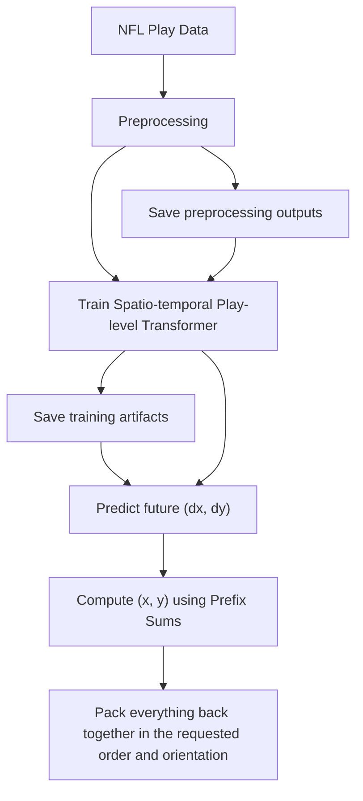
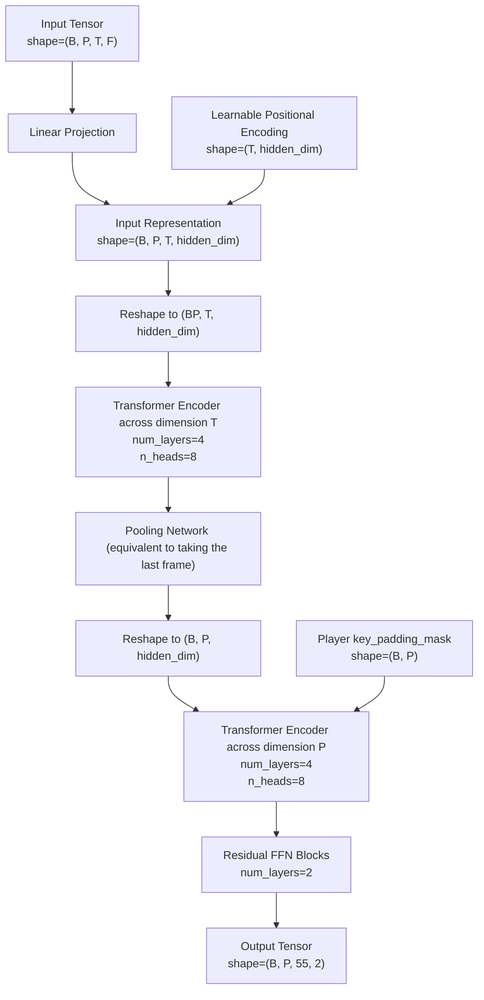
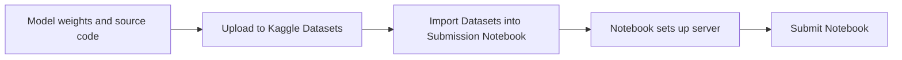

# 2026 NFL Big Data Bowl Silver Medal Solution Writeup

This repository contains my Silver Medal winning solution for the [2026 NFL Big Data Bowl Challenge](https://www.kaggle.com/competitions/nfl-big-data-bowl-2026-prediction). The task is to forecast player movement while a forward pass is in the air, using pre-throw NFL tracking data.

The solution combines physics-inspired feature engineering with a two-stage transformer that models each player's movements and their interactions on the field.

## Approach

### Feature Engineering
This solution uses a total of 111 dynamic features, including: 
- `x, y, s, a, dir, o, play_direction`, etc. &mdash; features that were already provided in the competition data. 
- Physics-inspired features like the kinetic energy, momentum, and inertia of the players
- Time-based features that describe how much time has elapsed in the game and how much time is remaining
- Heuristics that predict future frames: e.g. the position of the player assuming they travel in a straight line, or assuming that they travel with constant acceleration
- GNN-inspired features (modified from [this Kaggle notebook](https://www.kaggle.com/code/pankajiitr/nfl-big-data-bowl-2026-geometry-gnn))

Only the last 10 frames of input are used for prediction, and plays were rotated 180 degrees when necessary to standardize coordinates.

Post feature-extraction, the code fits a `StandardScaler` on the resulting data to apply standardization. 

### Architecture

**Overall Framework**

Below is the overall experimental framework for this solution. Because the code processes can run for extended periods of time, preprocessing and model training artifacts are saved with specific version numbering so progress can be restored easily. Ablations can be performed by modifying the configuration in `config.py`.

**Model Architecture**

This model architecture draws from the observation that a player-level model (as opposed to a _play_-level model) only takes in information about a single player for each prediction. It isn't utilizing any data about other players who are also in the game.  

The following spatio-temporal play-level model incorporates Transformer Encoders across both time and player dimensions, so both temporal information limited to a single player and interaction data between players are incorporated. 

A sequential structure is chosen &mdash; following the intuition that each encoder "eliminates" one dimension in the input representation. 


### Loss Function
This solution uses a modified version of Temporal Huber Loss:

Let $y_{\text{pred}} \in {\mathbb{R}}^{P \times 55 \times 2}$ be the model predictions, $y_{\text{true}} \in {\mathbb{R}}^{P \times 55 \times 2}$ be the ground truth, and $M \in {\mathbb{R}}^{P \times 55}$ be a binary mask. 

Define: 

$$
L = |y_{\text{true}} - y_{\text{pred}}| \in {\mathbb{R}}^{P \times 55 \times 2}
$$

$$h_{\delta}(x) = 
\begin{cases}
0.5x^2 & x \leq \delta \\
\delta(x - 0.5\delta) & \text{otherwise}
\end{cases}
$$

$$
w_{\lambda}(t) = \exp(-t \lambda)
$$

Then 

$$
\text{Loss} = \frac{\displaystyle \sum_{p=0}^{P-1} \sum_{t=0}^{54} \sum_{i=0}^{1} M_{p, t}\cdot w_{\lambda}(t)\cdot h_{\delta}(L_{p, t, i})}{\displaystyle 2\sum_{p=0}^{P-1} \sum_{t=0}^{54} M_{p, t} \cdot w_{\lambda}(t)}
$$


This was inspired by [Pankaj Gupta's Notebook](https://www.kaggle.com/code/pankajiitr/nfl-big-data-bowl-2026-geometry-gnn), which applied temporal weights to both the loss and mask tensors, therefore multiplying the numerator by `weight ** 2`:
```python
if self.time_decay > 0:
    L = pred.size(1)
    t = torch.arange(L, device=pred.device).float()
    weight = torch.exp(-self.time_decay * t).view(1, L, 1)
    huber = huber * weight
    mask = mask.unsqueeze(-1) * weight

return (huber * mask).sum() / (mask.sum() + 1e-8)
```
My implementation instead applies the temporal weight only once (multiplying by `weight`) and normalizes by the total weighted mask.

### Cross Validation and Experimental Results

I used a 5-fold CV over 5 seeds (888, 3407, 0, 42, and 1). RMSE scores were averaged to compute the CV score. My final submission was a 25-model ensemble, which scored approximately 0.54 on the private leaderboard and earned a Silver medal. The original training notebook I used can be found at `notebooks/train.ipynb`. 

A post-competition rerun of the same code scored **0.53083 on the private leaderboard.** Here are the local RMSE scores from cross-validation: 
| Seed |     F0 |     F1 |     F2 |     F3 |     F4 |
| ---: | -----: | -----: | -----: | -----: | -----: |
|  888 | 0.5516 | 0.5420 | 0.5607 | 0.5655 | 0.5849 |
| 3407 | 0.5740 | 0.5375 | 0.5664 | 0.5667 | 0.5679 |
|   42 | 0.5606 | 0.5365 | 0.5631 | 0.5777 | 0.5726 |
|    0 | 0.5564 | 0.5361 | 0.5549 | 0.5737 | 0.5875 |
|    1 | 0.5668 | 0.5319 | 0.5606 | 0.5688 | 0.5756 |
| Average | **0.5608** | | | | |

Training was conducted on a remote server:
- Python 3.12.3
- Ubuntu 24.04
- PyTorch CUDA 13.0
- GPU: NVIDIA RTX Pro 6000
- CPU: 28 vCPUs (AMD EPYC 9534)

Exact Python package versions are recorded in `requirements-lock.txt`.

## Run it
### Model Training
Choose one of the following installation commands for the required Python packages:
```bash
pip install -r requirements.txt # Install project dependencies
pip install -r requirements-lock.txt # Recreate the remote training environment
```

Next, download the official data from the [competition page](https://www.kaggle.com/competitions/nfl-big-data-bowl-2026-prediction/data). Preprocess the data by running: 
```bash
python preprocess.py --data-dir PATH_TO_DATA_DIRECTORY
```
where `PATH_TO_DATA_DIRECTORY` is just the path to the directory containing the competition data. This command will run the preprocessing loop and save relevant outputs &mdash; the preprocessed inputs and outputs, the `StandardScaler`, and the fold indices into a destination folder. You can choose the specific destination of these artifacts via the `--train-data-dir` CLI flag (otherwise the program will choose the default directory).

To train the play-level transformer and save model checkpoints, run: 
```bash
python train.py 
```
Select the `--train-data-dir` you want to load preprocessed data outputs from. It should contain three files called `train_data_25.npz`, `scaler_25.pkl` and `gkf_split_25.pkl`. You can also select the training artifacts directory via `--output-dir`. 

### Submission

Run `upload_to_kaggle.py` from `scripts/`. This uses `kagglehub` to automatically upload your timestamped model checkpoints and code to private Kaggle datasets under your account: 
```bash
python upload_to_kaggle.py --timestamp TIMESTAMP --username USERNAME
```
`TIMESTAMP` should be set to the timestamp corresponding to the desired training run you want to upload. `USERNAME` will just be your Kaggle username. 

**Note:** you'll need to have an access token for Kaggle in order to run this code. 
The script will prompt you to create some directories and upload the necessary files. 

Next, open a new Kaggle notebook in your account and import the `NFLPostCompetitionSubmissions.ipynb` file under `notebooks/`. Make sure the Kaggle datasets created by `upload_to_kaggle.py` are accessible to the notebook. Submit the Kaggle notebook to the competition. 

## License
MIT